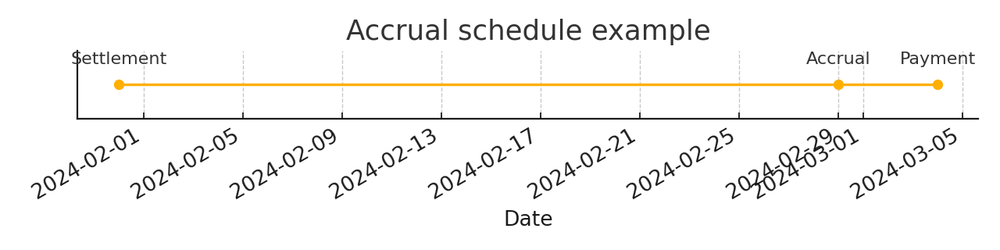

# Market Calendar Accrual Engine

I built this small library to generate accrual schedules and payment dates with US and UK holiday calendars. The work started at UC Berkeley and I shaped it into a production style Python package that reads clearly and is easy to extend.



## Highlights
* US and UK holiday sets
* Business day check
* Modified following convention
* Accrual date generation with Y Q M and W frequencies
* Payment date T plus two business days
* Day count ACT slash 360 with start exclusive and end inclusive

## Install
```
pip install -r requirements.txt
```

## Quick start
```python
import pandas as pd
from market_calendar import accrual_date, payment_date

stl = pd.Timestamp("20240131")
acc = accrual_date(stl, n_periods=1, freq="M")
pay = payment_date(acc)

print("Next accrual", acc.date())
print("Payment date", pay.date())
```

## API
* holidays_span start_year end_year
  Return a set of holiday timestamps across a span

* is_business_day date hol_set
  True for weekdays that are not in the holiday set

* is_last_day_of_month dt
  True if dt is the last calendar day of its month

* modified_following date hol_set
  Roll forward to the next business day then roll back to the prior business day if the month would change

* accrual_date settlement n_periods freq
  Return the adjusted accrual date from a settlement date

* add_business_days start n hol_set
  Move forward by n business days

* payment_date accrual
  Two business days after an accrual date

* accrual_period_days start end
  Actual days per ACT slash 360 with start exclusive and end inclusive

## Project structure
```
market_calendar_accrual_engine
    README.md
    LICENSE
    requirements.txt
    .gitignore
    assets
        accrual_schedule.png
    src
        market_calendar
            __init__.py
            engine.py
    tests
        test_engine.py
    examples
        quickstart.py
    notebooks
        accrual_engine_prototype.ipynb
        readme.md
```

## Development
Create a fresh environment of your choice and install dependencies from requirements.txt then run tests

```
pytest
```

## Notes for reviewers
I kept the scope tight on purpose so the logic is easy to audit. The public API mirrors the typical calendar primitives used in fixed income and swaps. If you want to see extensions such as business day counts or additional day count conventions I can add them quickly.

## Provenance
I wrote the core engine and refined it from earlier research work at UC Berkeley. The package here presents it as a reusable component with tests and a quick start example.
